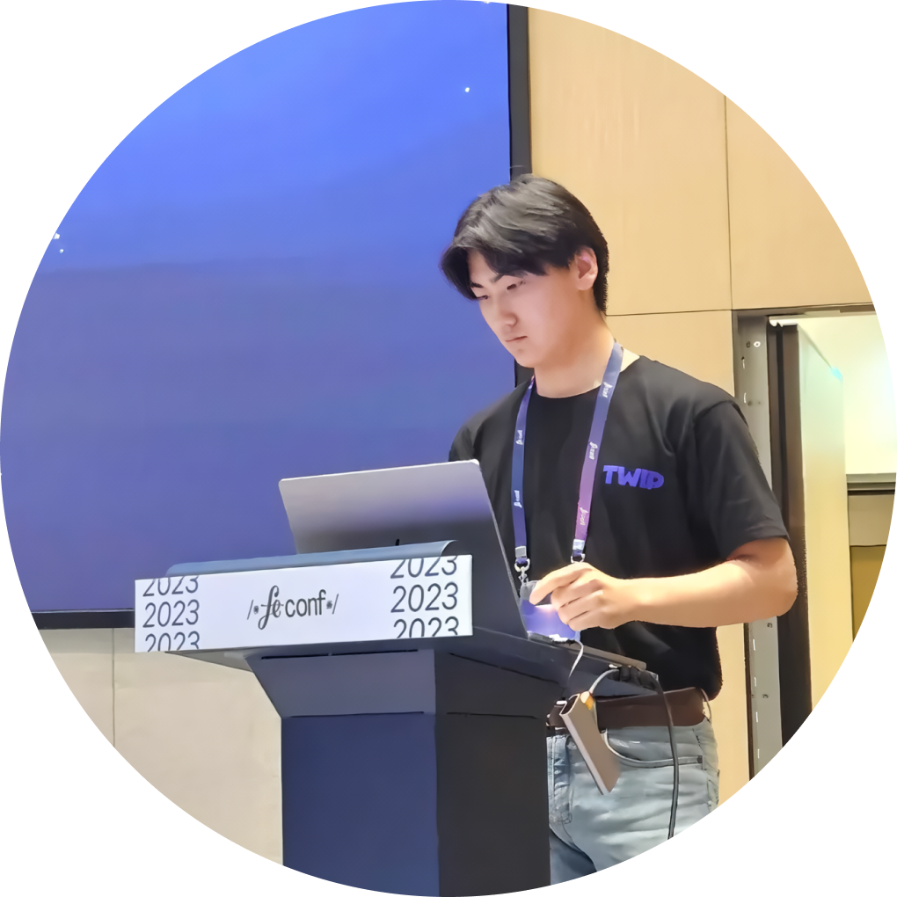

👋 반갑습니다!  
 _강민수(Kang Min Su, BETAMAN)입니다!_
===================================

  

창조하는 즐거움을 알고,  
실험적인 아이디어들의 빠른 검증과 서비스화가 특기인 Web Full-Stack Developer 입니다 😎
-----------------------------------------------------------------------

💌 E-Mail: skymin0417@gmail.com  
📚 Blog: https://blog.betaman.dev  
⭐️ Instagram: https://instagram.com/kangdev_04  
📝 Resume/Portfolio: https://betaman.dev  

## [🔗 이력서/포트폴리오 사이트 바로가기](https://betaman.dev)

-----------------------------------------------------------------------

# Portfolio

더욱 상세한 포트폴리오는 [포트폴리오 사이트](https://betaman.dev)를 참고해주세요!

|프로젝트 유형|프로젝트명|진행일자|내용|
|----------|-------|------|---|
|Side Project|[CHINGOO.BE](https://betaman.oopy.io/cf2e9932-37d9-45be-bd69-78cfdc0bf062)|2024.02 ~ 2024.02.22|토스 익명송금과 연동되는 친구비 영수증 서비스|
|Side Project|[KAMY](https://betaman.oopy.io/87c98642-39d5-48d3-83da-027936b822df)|2023.09.23 ~ 2023.09.25|헤커톤(Unithon 10기) 참여작품 - 영업사원 인맥 관리 서비스|
|Product|[TWIP Chrome Extension](https://betaman.oopy.io/4f9e3681-828a-470e-a887-bfda6d253935)|2023.09.04 ~ 2023.09.22|주식회사 이제이엔의, 더욱 편리한 TWIP 생활을 제공하는 Chromium 기반 브라우저 확장 프로그램|
|Side Project|[Desktop Web Overlayer](https://betaman.oopy.io/0ab7f2d0-75e3-4f7e-98a5-b8f4a0d50bbe)|2023.07.09 ~ 2023.07.26|데스크탑 화면에 웹 페이지 오버레이를 띄울 수 있는 Electron 유틸리티|
|Product|[TWIP](https://betaman.oopy.io/2d20cb3e-5363-442a-afec-76894f2e5f1f)|2022.05.08 ~ 진행 중|주식회사 이제이엔의, 크리에이터와 시청자 간 소통을 돕고 지속 가능한 창작활용을 위해 다양한 수익화 방안을 제공하는 크리에이터 후원 서비스|
|Product|[BRIYA ARK 솔루션](https://betaman.oopy.io/0ac4f1d1-8acb-4c83-9271-370d34b87927)|2023.01.04 ~ 2023.05.07|주식회사 브리야의, AI CCTV 영상 분석 기반 화재/생존자 정보 도면 맵핑 솔루션|
|Side Project|[Clippy](https://betaman.oopy.io/ebb02dbe-674f-4bd3-aca4-bb731dacf187)|2022.12.14 ~ 2023.02.14|(✨MAU 4만 달성✨) Twitch 한국 VOD 서비스 종료에 대응한 클립/다시보기 서드파티 서비스|
|Side Project|[Clippy Chrome Extension](https://betaman.oopy.io/be702035-ef66-4dab-b457-4384328ba6d2)|2022.12.14 ~ 2023.02.14|Clippy를 더욱 간편하게 이용할 수 있는 크롬 확장 프로그램|
|Side Project|[RIVER NOW](https://betaman.oopy.io/184499d3-c994-4b42-b412-26db363f3f35)|2022.08.09 ~ 2022.12.08|(✨2022년 공공데이터 활용 서비스 개발 공모전 최우수상 수상작✨) 여러 기관에서 제공 중인 하천수위 공공데이터를 통합하여 시각화된 하천수위 현황을 보여주는 재해안전 서비스|
|Side Project|[TWIP ChatBox test tool Chrome Extension](https://betaman.oopy.io/164e2856-08e9-469d-a837-ab9cdb9961c0)|2022.08.02 ~ 2022.08.22|TWIP ChatBox 테마 제작 시 필요한 채팅 테스트와 소스코드 자동 저장 및 템플릿 관리를 도와주는 Chromium 기반 브라우저 확장프로그램|
|Side Project|[트위치 챈카페 확장 패널](https://betaman.oopy.io/c133d5b7-e047-4da4-8cd1-7786d7381569)|2022.07.07 ~ 2022.07.19|트위치 스트리머 팬카페의 글목록을 트위치 확장 패널로 제공하는 서비스|
|Side Project|[STREAM-MUSIC](https://betaman.oopy.io/e1525816-c47c-4539-8701-f34151665279)|2022.05.11 ~ 2022.05.27|음악방송을 위한 라이브 스트리밍 플레이리스트 위젯 오버레이 및 음원 플레이어 서비스|
|Side Project|[TWIP ChatBox 커스텀 테마](https://betaman.oopy.io/640cf23b-8ea4-409a-b68e-9f75af55f97f)|2021.12.01 ~ 진행 중|TWIP ChatBox에서 사용 가능한 커스텀 테마 제작|
|Product|[아이엠바이어 - iambuyer](https://betaman.oopy.io/6e50d7fb-cb0d-4f5e-a83d-87b290ab0241)|2021.03.05 ~ 2021.11.26|중국 최대 B2B 전자상거래 플랫폼 기업 후이총왕 공식 국내 총판 (주)케이플랫폼의 iambuyer 서비스와 백오피스 외주 개발|

-----------------------------------------------------------------------

# Tech Stack

기술 영역 별로, 평소에 즐겨 사용하는 라이브러리 & 프레임워크들을 모았습니다.

  
  

## Frontend

|분류|기술|
|----|---|
|UI Library & Framework|     |
|State Management|    |
|DataSource & Fetching|      |
|Styling|    |
|Design System|      |
|Bundling|    |
|Monorepo|     |
|Analytics & Monitoring|    |
|Test|   |
|Etc.|  |

## Backend

|분류|기술|
|---|---|
|Library & Framework|    |
|DataBase & ORM|       |
|Analytics & Monitoring|  |
|Test|  |
|Etc.|    |

## DevOps

|분류|기술|
|---|---|
|DevOps|          |
